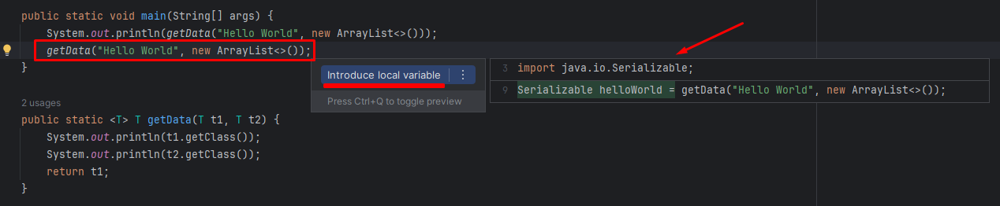

Type Inference

Type inference is the ability of the compiler to look at each method invocation and corresponding declaration in
order to determine the type argument(s) - such as T generic type - that make the invocation applicable.

THE TYPE INFERENCE ALGORITHM DETERMINES THE <T> TYPE OF THE ARGUMENTS
plus the type that the result is being assigned or returned if available

    public <T> T getData(T t1, T t2) {
        return t1;
    }

The type inference algorithm tries to find the most specific type that works with all the arguments

    Serializable s = getData("Hello World", new ArrayList<>());

There is no need to specify the tpye because of type inference

    List<String> list = new ArrayList<>();

because of the type inference algorithm we can use class instantiation like this: new ArrayList<>()
type inference enables us to invoke a generic method as an ordinary Java method without specifying the type

Quiz

1. What is the motivation behind type inference?
Type inference is the ability of the compiler to determine the type of argument(s) and the type of the returned value.
2. Type inference algorithm tries to find the most specific type that works with all the arguments. True

